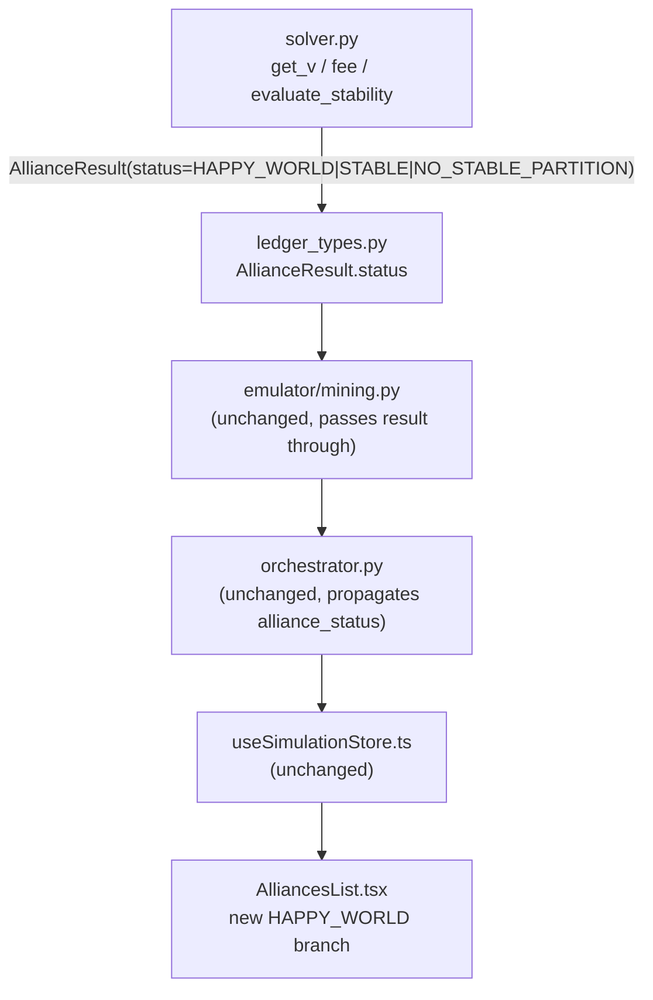

# Solver Redesign — Step-by-Step Implementation Plan

Ordered from most beneficial to least. Each step is a separable, testable commit.

## Step 1 — Replace `get_v()` with the hedonic fee model (the core fix)

**File:** [`backend/engine/solver.py`](backend/engine/solver.py)

Current `get_v` returns `Σ powers` (plain additive). Replace with:

```
payoff(S) = power(S) - fee(S)
fee(S)    = α · power(S) · (|S| - 1)^β
fee({i})  = 0   (going solo costs nothing)
```

Decisions locked in:
- Fee is **relative** to alliance power (scales with the world's size).
- Starting defaults: `α = 0.10`, `β = 1.5`.
- The `num_alliances` parameter is no longer needed; remove it.
- The internal hegemony power-cap (`pwr / total_power > 0.5`) is made redundant by the ratio rule (step 2 cleans it up); remove it here.

Add `fee()` as a method on `StrategicMilitarySim`:

```python
def fee(self, S: List[str]) -> float:
    k = len(S)
    if k <= 1:
        return 0.0
    return self.alpha * self.get_alliance_power(S) * ((k - 1) ** self.beta)

def get_v(self, S: List[str]) -> float:
    if not S:
        return 0.0
    return self.get_alliance_power(S) - self.fee(S)
```

Also add `alpha` and `beta` as constructor parameters.

---

## Step 2 — Rewrite `evaluate_stability()` around club-good payoffs

**File:** [`backend/engine/solver.py`](backend/engine/solver.py)

Current code:
```python
payout_per_country = total_v / len(alliance)   # equal split — wrong
if payout_per_country + epsilon < v_solo:       # exploited check
```

Replacement logic:
- Every member of alliance S receives `payoff = get_v(S)` (the whole fee-adjusted value, not a split).
- Exploitation check becomes: `payoff + epsilon_i < v_solo` where `epsilon_i = epsilon_fraction * v_solo`.
- The hegemony block (`total_v == 0`) naturally disappears — a negative `get_v` makes an alliance unattractive without a special case.
- The `STATUS_HEGEMONY` constant and stats counter can be removed (or kept as dead code for one transition cycle).

New `evaluate_stability` flow:

```
1. single-pole check (< 2 alliances) → same as now
2. ratio check (max/min > ratio_limit) → same as now
3. for each alliance S in partition:
     payoff = get_v(S)
     for each country i in S:
         v_solo = countries[i]
         epsilon_i = epsilon_fraction * v_solo
         if payoff + epsilon_i < v_solo → EXPLOITED, return inf
4. balance_penalty = (ratio - 1.0) * 100 → VALID
```

---

## Step 3 — Make epsilon relative

**File:** [`backend/engine/solver.py`](backend/engine/solver.py)

Replace the flat `epsilon = 60.0` constructor parameter with `epsilon_fraction = 0.05` (5% of each country's solo power). The absolute epsilon varies per country and scales with the world.

Update the `calculate_alliances()` call at the bottom of the file to pass the new parameter name.

Also fix the hardcoded print string:
```python
# line 218 — currently prints "epsilon=60.0" regardless of actual value
f"ratio_limit={ratio_limit}x epsilon_fraction={epsilon_fraction}"
```

---

## Step 4 — Add the "Happy World" terminal state

**Files:** [`backend/engine/solver.py`](backend/engine/solver.py), [`backend/emulator/ledger_types.py`](backend/emulator/ledger_types.py), [`frontend/src/components/simulation/AlliancesList.tsx`](frontend/src/components/simulation/AlliancesList.tsx)

### Backend (`solver.py`)

In `find_best_outcome()`, after the main loop produces `best = None`, check whether the **grand coalition** passes individual rationality (every country's payoff ≥ solo + epsilon_i). If yes, return a special sentinel:

```python
STATUS_HAPPY_WORLD = "HAPPY_WORLD"
```

Return `([list_of_all_players], 0.0)` with a new status field, or handle it in `calculate_alliances()`:

```python
if best is None:
    if _grand_coalition_is_individually_rational(sim):
        return AllianceResult(alliances=[sorted(players)], stability_score=0.0, status="HAPPY_WORLD")
    return AllianceResult(alliances=[], stability_score=None, status="NO_STABLE_PARTITION")
```

The single-pole veto is bypassed only for this specific check — it is not removed from the main search loop.

### Frontend (`AlliancesList.tsx`)

Add a check alongside the existing `isUnstableWorld`:

```tsx
const isHappyWorld = alliance_status === "HAPPY_WORLD";
```

Show a distinct message/chip when `isHappyWorld` is true (e.g. a success-colored banner: "The world is in peace. Happy world!").

---

## Step 5 — Remove the redundant hegemony cap from `get_v`

**File:** [`backend/engine/solver.py`](backend/engine/solver.py)

With step 1 in place, the old `pwr / total_power > cap` guard inside `get_v` is dead code. Remove `STATUS_HEGEMONY`, the `hegemony` stats counter, and the `num_alliances` parameter entirely. This makes the code smaller and easier to reason about.

---

## Step 6 — Expose fee parameters as tunable constants in `calculate_alliances()`

**File:** [`backend/engine/solver.py`](backend/engine/solver.py)

Move `ratio_limit`, `alpha`, `beta`, `epsilon_fraction` out of the hardcoded constructor call so callers (or a future config file) can override them:

```python
def calculate_alliances(
    troop_ledger: Dict[str, int],
    current_alliances: Optional[List[List[str]]] = None,
    ratio_limit: float = 1.5,
    alpha: float = 0.10,
    beta: float = 1.5,
    epsilon_fraction: float = 0.05,
) -> AllianceResult:
```

This makes it easy to run experiments on the fee curve without changing the function body.

---

## Step 7 — Add regression test fixtures

**New file:** `backend/engine/tests/test_solver.py`

Five hand-built scenarios that must always pass after any future change to the fee curve:

- **2 equal countries** — both solo, ratio = 1.0, expect STABLE with no alliances.
- **3 equal countries** — any 2-vs-1 split is balanced; expect STABLE.
- **USA/Canada/Mexico baseline** (51k/30k/25k) — the canonical failing scenario; with new model expect `[USA] / [Canada, Mexico]`, status STABLE.
- **Dominant superpower** — one country is 10× all others combined; expect WW3 (`NO_STABLE_PARTITION`).
- **Grand coalition** — two nearly equal countries where any split violates ratio but the grand coalition is individually rational; expect `HAPPY_WORLD`.

---

## Data flow summary



Only `solver.py`, `AlliancesList.tsx`, and the new test file require substantive changes. Every layer in between is already wired correctly.

---

## Default parameters to start with

- `ratio_limit = 1.5` (unchanged)
- `alpha = 0.10`, `beta = 1.5` → `fee(S) = 0.10 · power(S) · (|S|−1)^1.5`
- `epsilon_fraction = 0.05` (5% loyalty cushion per country)

These should be revisited after running the regression tests in step 7.
